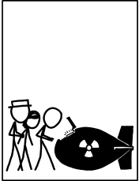

<!-- effect=matrix -->

---

# Advanced Shell Usage

Liam Doherty

<!-- fg=white bg=blue -->

---

## Welcome and using Zoom

This is an interactive session and your participation is welcome and encouraged!

During the workshop, please feel free to ask or answer questions by:

- Raising your hand
- Typing in the chat
- Turning on your microphone

You are also welcome to hold your questions until the end of the session.

---

## Introduction



> Simply enter a valid `tar` command to disarm.

Source: [xkcd: tar](https://xkcd.com/1168/)

---

## Getting started

```bash
wget https://github.com/ubc-library-rc/advanced-shell/archive/refs/heads/main.zip
unzip main.zip
cd advanced-shell-main
```

---

## Customizing the shell


---

## Getting help

In the intro-shell workshop, we cover some basic ways to get help in the shell, e.g.:

* `help`
* `whatis`
* `apropos`
* `man`
  * and `man hier`

---

There are also other ways to get help.

First, there is a comprehensive guide to the Unix Shell and GNU CoreUtils that is accessible by simply typing `info`.

---

You can also get community-sourced help using a service like Cheat.sh

```bash
curl cheat.sh/tar
curl cheat.sh/python/split
curl cheat.sh # usage info
```

---

## Breaking down workflows


---

## Working with filesystems and data

Refresher of basic concepts:

- `>`: Redirect to a file
- `<`: Take input from a file
- `|`: Send output to another program
- `>>`: **append** to an existing file
- display output but **also** write it to a file:
  - example: `ls | tee outfile.txt`

---

Examples:

```bash
date > test.md # Create a file called "test.md" with the current date
date >> test.md # Append the date to an existing file "test.md"
date | grep Fri # Look for a string "Fri" in the output of date
sort < test.md # Sort the contents of test.md
```

---

Other ways of working with files:

- `du` and `df`: show directory and disk usage
- `tree`: list directory contents in a tree-like format
- `mc`: (Midnight Commander) visual shell

---

Midnight Commander basics:

- `F9`: Access menu
- `Alt+.`: Hide hidden files and directories
- `F5`: Copy files from one pane to the other
- `F6`: Rename/move files
- `F7`: Make new directory
- `+` and `-` to select files, `*` to invert selection
- `Alt+C`: Quick change directory

---

## Working with multimedia

Did you know that you can work with multimedia files directly in the terminal?

---


Source: [Tiger swallowtail](https://commons.wikimedia.org/wiki/File:Tiger_swallowtail_(74863).jpg) - Wikimedia Commons

---

## Tools for working with multimedia

- `mplayer`: movie and audio player
- `ffmpeg`: video converter
- `imagemagick`: create and edit bitmap images

---

- `moc`: (Music on Console) terminal music player

---

Thank you!

<!-- effect=explosions -->
